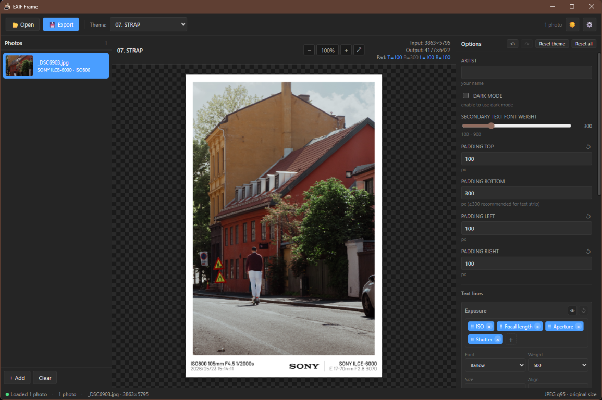

# EXIF Frame for Windows

📸 → 🖼️ A native **Windows desktop** app that wraps your photos in customizable themed frames displaying camera, lens, ISO, aperture, shutter speed and other EXIF metadata.

This is a desktop port of and derivative work based on
[jeonghyeon-net/exif-frame](https://github.com/jeonghyeon-net/exif-frame)
(a mobile/web app). It is rebuilt with **Tauri 2 + React 18 + TypeScript** →
a small native installer, native file dialogs and drag-drop, no Electron bloat.

> **License note:** The original project is licensed under the **GNU GPL v3**, and
> so is this one. See [License & Attribution](#license--attribution) below.

## Features

- **16 frame themes** ported from the original: NO FRAME, JUST FRAME, ONE LINE,
  TWO LINE, SHOT ON (one/two line), STRAP, FILM, MONITOR, LIGHTROOM, CUSTOM
  (one/two line), TIP, POSTER, CINEMASCOPE, SIMPLE.
- **Native-resolution export** — the photo keeps its original resolution; the
  frame is added around it instead of downscaling to 4096px like the original.
- **Maker logos** — brand logos (Sony, Canon, Nikon, Fujifilm, …) rendered on
  supported themes instead of plain text.
- **Draggable layout** — drag any text line or logo directly on the preview to
  reposition it, with pink **snap guides** for alignment. Dividers can be dragged
  off to remove and restored from the Options panel.
- **Undo / redo** — every per-theme edit (element moves, padding, templates,
  colors, sliders, …) is undoable via the `↶` / `↷` buttons or `Ctrl+Z` / `Ctrl+Y`.
- **Field ↔ element highlighting** — hovering a template/text input in the Options
  panel highlights the matching element in the preview, so you can see what each
  input controls.
- **Pill-based template editor** — compose info lines from draggable field pills
  (Maker, Body, Lens, ISO, Focal length, Aperture, Shutter, Date) instead of
  typing `{TOKEN}` strings.
- **Preview zoom** — Ctrl+scroll, Ctrl +/−/0, or on-screen buttons; fit-to-window
  by default.
- **Smart focal length** — shows the 35mm-equivalent focal length by default
  (from EXIF or computed from the sensor crop factor), with a setting to use the
  raw camera focal length instead.
- **Per-theme persisted customization** — every option, layout drag and template
  change is saved per theme; per-field and per-theme reset buttons included.
- Drag-drop photos in from Explorer, per-photo metadata overrides, global
  maker/model/lens override, batch export, JPEG/PNG/WebP output at adjustable
  quality, resize on export, burn-in watermark, dark / light mode.
- All preferences persist via the Tauri Store plugin to
  `%APPDATA%\com.exifframe.windows\settings.json`.

## Screenshots

## Screenshots



## Quick start

### 1. Install prerequisites

| Tool                | Version    | Notes                                            |
|---------------------|-----------:|--------------------------------------------------|
| Node.js             | 20+        | https://nodejs.org/                              |
| Rust                | 1.77+      | `winget install Rustlang.Rustup` then `rustup default stable-msvc` |
| VS Build Tools 2022 | 17+        | **Required.** Double-click `Install-BuildTools.bat` and choose "Run as administrator" |

> **Why VS Build Tools?** Tauri uses the Rust MSVC toolchain on Windows, which
> needs `link.exe` and the Windows SDK from VS Build Tools. The install takes
> 15–30 minutes; you only need to do it once.

### 2. Install dependencies

```powershell
npm install
```

### 3. Run in development

```powershell
npm run tauri:dev
```

Hot-reload of the React frontend, full Tauri runtime, dev tools available.

### 4. Build an installer

```powershell
npm run tauri:build
```

Produces:
- `src-tauri\target\release\bundle\msi\EXIF Frame_0.1.0_x64_en-US.msi`
- `src-tauri\target\release\bundle\nsis\EXIF Frame_0.1.0_x64-setup.exe`

Both are unsigned. To sign, configure a code-signing cert in
`src-tauri\tauri.conf.json` under `bundle.windows.certificateThumbprint` and
re-build.

## Keyboard shortcuts

| Shortcut       | Action                          |
|----------------|----------------------------------|
| **Ctrl + O**   | Open photos                      |
| **Ctrl + S**   | Export                           |
| **Ctrl + ,**   | Settings                         |
| **Ctrl + Z**   | Undo theme edit                  |
| **Ctrl + Y** / **Ctrl + Shift + Z** | Redo theme edit     |
| **Ctrl + +/−** | Zoom preview in / out            |
| **Ctrl + 0**   | Reset preview zoom (fit)         |
| **Ctrl + scroll** | Zoom preview                  |
| **Del**        | Remove selected photo            |
| **↑ ↓ ← →**    | Navigate between photos          |

## Project layout

```
src/
  core/
    drawing/                 canvas pipeline (sandbox, render, resize, elements, ...)
    exif/                    EXIF parsing + override helper
  themes/                    16 frame themes + shared helpers
  components/                React UI components
  fonts/                     font registration
  store.ts                   zustand + Tauri-store persistence (with migrations)
  App.tsx                    top-level layout, state, shortcuts
src-tauri/
  src/                       Rust shell (registers plugins, no custom commands)
  tauri.conf.json            window, bundle and security config
  capabilities/default.json  permission grants for dialog / fs / store
  icons/                     app icons
```

## Replacing the app icon

Replace `src-tauri\icons\icon.png` with your own 512×512 (or larger) source PNG,
then regenerate the icon set:

```powershell
npx @tauri-apps/cli icon "src-tauri\icons\icon.png"
```

## Custom display fonts

The original mobile app ships with proprietary display fonts (Digital-7, Poxel,
DIN Alternate Bold, Pretendard). Drop their `.ttf` files into `public\fonts\`
(matching the names in `src\fonts\index.ts`) and they'll be picked up
automatically; otherwise the app falls back to a system font stack.

## License & Attribution

This project is licensed under the **GNU General Public License v3.0** — see the
[`LICENSE`](LICENSE) file for the full text.

It is a Windows desktop **port and derivative work** of
[jeonghyeon-net/exif-frame](https://github.com/jeonghyeon-net/exif-frame)
(© jeonghyeon-net, licensed under GPL v3). Significant portions of the theme
rendering, EXIF parsing, sandbox/canvas math and frame logic are adapted from
that project. All credit for the original concept and frame designs goes to its
author.

### Notable changes from the original

- Rebuilt as a **Tauri 2 + React 18 + TypeScript** desktop application for Windows.
- **Native-resolution export** instead of the 4096px canvas cap (the photo keeps
  its full resolution; the frame is scaled around it).
- **Draggable element layout** with snap-to-align guides, plus removable/restorable
  dividers.
- **Pill-based template editor** replacing the `{TOKEN}` text syntax.
- **Automatic crop-factor focal length** (35mm-equivalent by default, computed from
  EXIF sensor data when not provided).
- **Preview zoom**, per-theme persisted customization with schema migrations,
  desktop UX (keyboard shortcuts, native dialogs, drag-drop), and quality/sharpness
  improvements to the downscaling pipeline.

As required by the GPL, this project is distributed under the same license, the
original copyright is retained, and the changes above are stated. You are free to
use, study, modify and redistribute it under the terms of the GPL v3.
